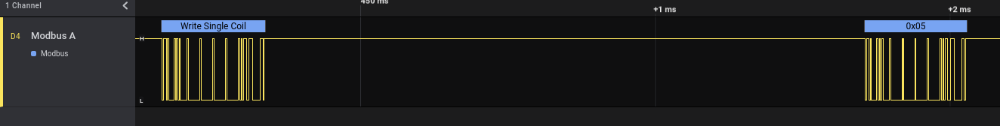
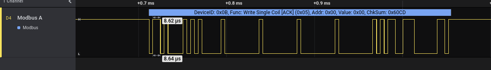

This folder contains 2 example captures - one of a request and response together, and one of just the response.

This is done to demonstrate how the client + server dual decoder can handle both, leveraging the "Starts with Response" setting.

### Request and Response
The first capture is `request_and_response.sal`.  that is shown here for convenience:

you will see that this correctly stops the frame at the end of the request, with the appropriate checksum, and does not show any decoding occurring during the time between frames.  It then resumes decoding upon the server's response.

### Response Only

The second capture is `response.sal`, which looks like this:

This can be recreated by trimming the request off of the `request_and_response.sal` and toggling the "Starts with response" boolean in the analyzer settings.  